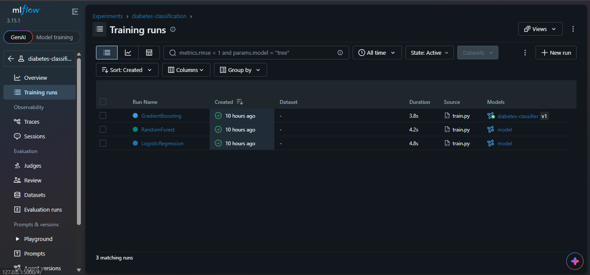
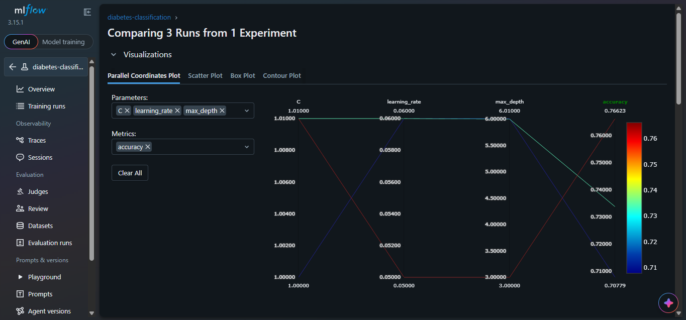
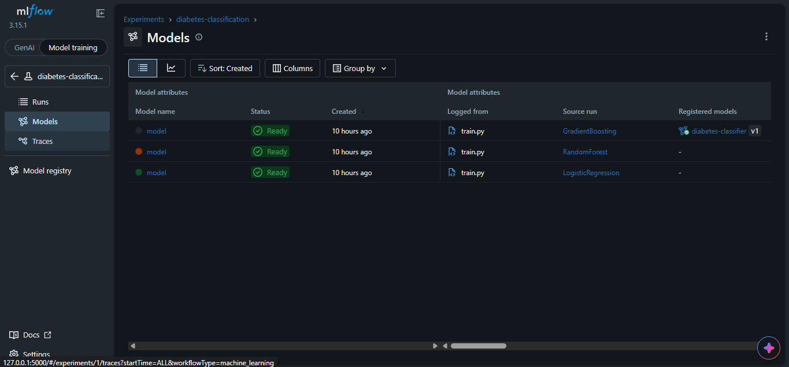
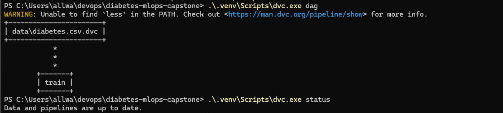
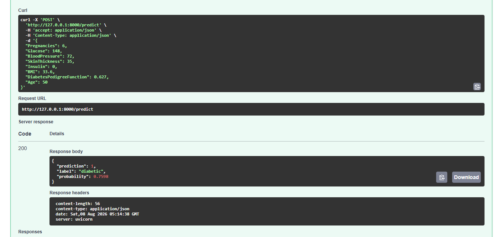
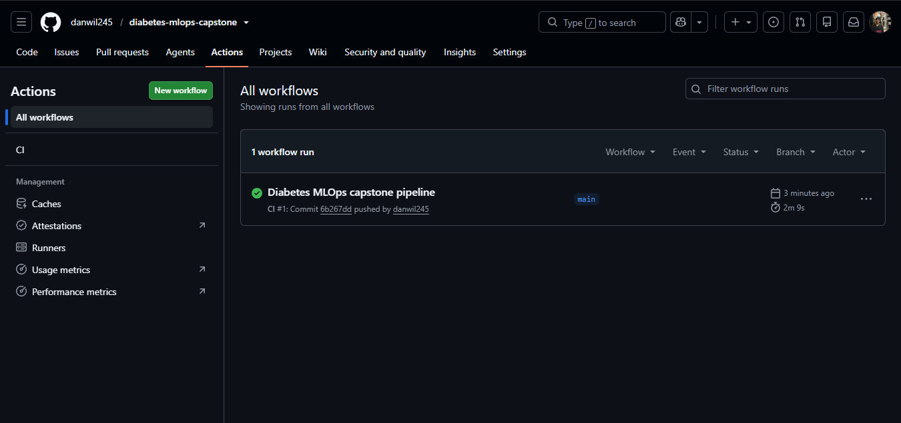

# Diabetes Prediction MLOps Project

An end-to-end MLOps pipeline for **Diabetes Prediction** (Diabetic vs. Not Diabetic) using scikit-learn, MLflow, DVC, FastAPI, Docker, and GitHub Actions. Built on the Pima Indians Diabetes dataset.

## 🏗️ Project Structure

```
.
├── data/                        # Dataset (versioned with DVC)
│   ├── diabetes.csv
│   └── diabetes.csv.dvc         # DVC pointer (tracked by git)
├── models/                      # Trained model artifacts (best_model.joblib + metrics)
├── src/
│   ├── train.py                 # Trains 3 models + MLflow tracking + registry
│   ├── app.py                   # FastAPI prediction service
│   ├── predict.py               # Inference helper (loads the best model)
│   └── utils.py                 # Data loading & preprocessing utilities
├── tests/
│   ├── conftest.py              # Trains a model if none exists (CI safety)
│   └── test_pipeline.py         # Model + API endpoint tests
├── .github/
│   └── workflows/
│       └── ci.yml               # GitHub Actions CI pipeline
├── Dockerfile                   # Container image (app + deps + model)
├── requirements.txt
├── dvc.yaml                     # DVC pipeline definition
├── dvc.lock                     # Reproducibility lock file
├── .gitignore
└── README.md
```

## 🚀 Quick Start

> Windows note: on this machine use `py -3.13` and a virtual environment, because plain `python` may point to a different install.

### 1. Install dependencies
```bash
py -3.13 -m venv .venv
.\.venv\Scripts\Activate.ps1        # Windows PowerShell
pip install -r requirements.txt
```

### 2. Dataset & DVC tracking
The dataset is already tracked with DVC (`data/diabetes.csv.dvc`). To inspect the versioning:
```bash
dvc dag        # shows: data/diabetes.csv.dvc -> train
dvc status     # "Data and pipelines are up to date."
```

### 3. Train models
```bash
python src/train.py
```
This trains **Logistic Regression, Random Forest, and Gradient Boosting** — logs every experiment to MLflow, prints a comparison table, and registers the best model (by ROC-AUC) in the MLflow Model Registry.

### 4. View MLflow experiments
```bash
mlflow ui --backend-store-uri sqlite:///mlflow.db
```
Open http://localhost:5000 in your browser to compare the three runs and see the registered model.

### 5. Run the FastAPI server
```bash
uvicorn src.app:app --host 0.0.0.0 --port 8000 --reload
```
Open http://localhost:8000/docs for the interactive Swagger UI.

### 6. Make a prediction
```bash
curl -X POST http://localhost:8000/predict \
  -H "Content-Type: application/json" \
  -d '{
    "Pregnancies": 6,
    "Glucose": 148,
    "BloodPressure": 72,
    "SkinThickness": 35,
    "Insulin": 0,
    "BMI": 33.6,
    "DiabetesPedigreeFunction": 0.627,
    "Age": 50
  }'
```
Response:
```json
{ "prediction": 1, "label": "diabetic", "probability": 0.7598 }
```

### 7. Run tests
```bash
pytest tests/ -v
```

### 8. Build & run Docker
```bash
docker build -t diabetes-api .
docker run -p 8000:8000 diabetes-api
```

## 📊 Models Trained

| Model | Description | ROC-AUC |
|-------|-------------|:-------:|
| Logistic Regression | Baseline linear classifier (standard-scaled) | 0.813 |
| Random Forest | Ensemble of 300 decision trees (max_depth=6) | 0.808 |
| **Gradient Boosting** ⭐ | Boosted ensemble (200 estimators, lr=0.05) | **0.831** |

Full metrics on a stratified 20% hold-out test set:

| Model | Accuracy | Precision | Recall | F1 | ROC-AUC |
|-------|:--------:|:---------:|:------:|:--:|:-------:|
| **GradientBoosting** ⭐ | 0.766 | 0.688 | 0.611 | 0.647 | **0.831** |
| LogisticRegression | 0.708 | 0.600 | 0.500 | 0.545 | 0.813 |
| RandomForest | 0.734 | 0.651 | 0.519 | 0.577 | 0.808 |

The best-performing model (by ROC-AUC) is automatically registered in the MLflow Model Registry as **`diabetes-classifier`** and marked with the **`production`** alias. All three models bake preprocessing into an sklearn `Pipeline`: impossible zeros (e.g. a Glucose or BMI of 0) are treated as missing, median-imputed, and — for Logistic Regression — standard-scaled.

## 🔌 API Endpoints

| Method | Endpoint | Description |
|--------|----------|-------------|
| GET | `/health` | Health check + which model is loaded |
| POST | `/predict` | Single prediction (returns class, label, probability) |
| GET | `/docs` | Swagger UI |
| GET | `/redoc` | ReDoc UI |

## 🔄 CI/CD Pipeline (GitHub Actions)

The workflow in `.github/workflows/ci.yml` runs on every push/PR:

1. **Checkout** the repository
2. **Set up Python** 3.13
3. **Install** dependencies
4. **Train** the models (produces the model artifact)
5. **Run** `pytest tests/`
6. **Build** the Docker image and smoke-test `/health` in the container

Build + test only — no deployment step.

## 📋 Dataset

**Pima Indians Diabetes Dataset**:

- 768 samples, 8 numerical features
- Binary classification: `0` = Not Diabetic, `1` = Diabetic (`Outcome` column)
- Features: Pregnancies, Glucose, BloodPressure, SkinThickness, Insulin, BMI, DiabetesPedigreeFunction, Age
- Versioned with DVC

## 🛠️ Technology Stack

| Component | Technology |
|-----------|------------|
| Language | Python 3.13 |
| ML | scikit-learn |
| Experiment Tracking | MLflow (SQLite backend) |
| API | FastAPI + Uvicorn |
| Data Versioning | DVC |
| Containerization | Docker |
| CI/CD | GitHub Actions |
| Testing | pytest |

## 📸 Project Screenshots

### 1. MLflow Experiment Tracking — Three Training Runs
The three models (Logistic Regression, Random Forest, Gradient Boosting) logged as separate runs in the `diabetes-classification` experiment.



### 2. MLflow Run Comparison
Comparing all three experiments side by side across parameters and metrics.



### 3. MLflow Model Registry — Registered Best Model
The best model registered as `diabetes-classifier` (version 1) with the `production` alias.



### 4. DVC Data Versioning
`dvc dag` showing the pipeline and `dvc status` confirming data and pipelines are up to date.



### 5. FastAPI Prediction Endpoint
`POST /predict` returning a prediction with class, label, and probability.



### 6. GitHub Actions CI Pipeline
A successful CI run (build → test → Docker build) on push to `main`.


